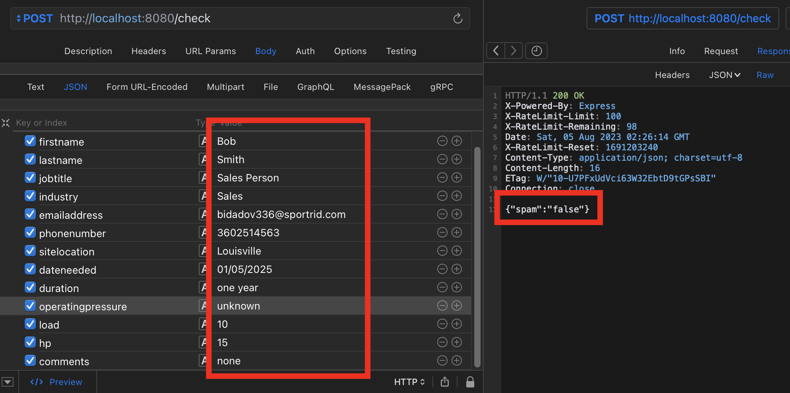

# form-spam-tensorflow

Catching form spam with an AI model and TensorFlow.js.... The spam is very specific to a client website and it's getting past both Cloudflare and Recaptcha, so I wanted to try a new approach.

NOT PRODUCTION READY

## Screenshots

Posting form data to my Express.js server endpoint, `check`

Sample POST requests with dummy data

Not Spam

Spam

## Notes

`node app.js`

### The Model

I used [liner.ai](liner.ai) to generate a model that has two classes, `Good` and `Bad`. I grabbed spam and non spam submissions out of a specific form and turned each form
entry into a `field reponse | field reponse ` line, whcih I then grab and categorized.

## Node

It uses Node.js with Express.js to run the server. Tensorflow.js handles the actual AI stuff... This is using Node 16
